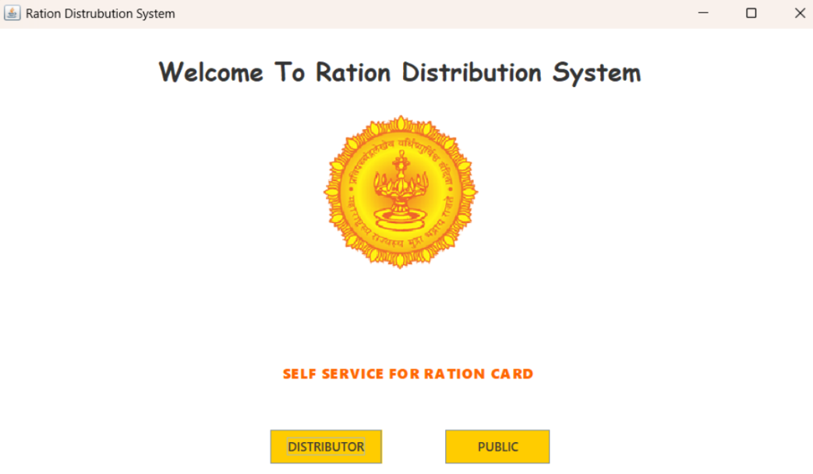
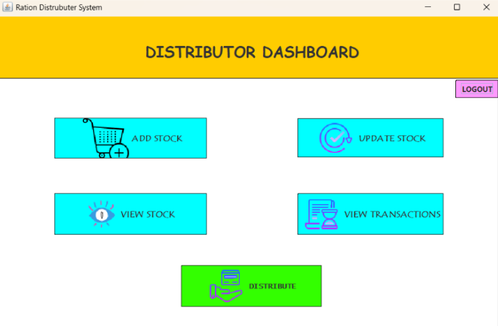
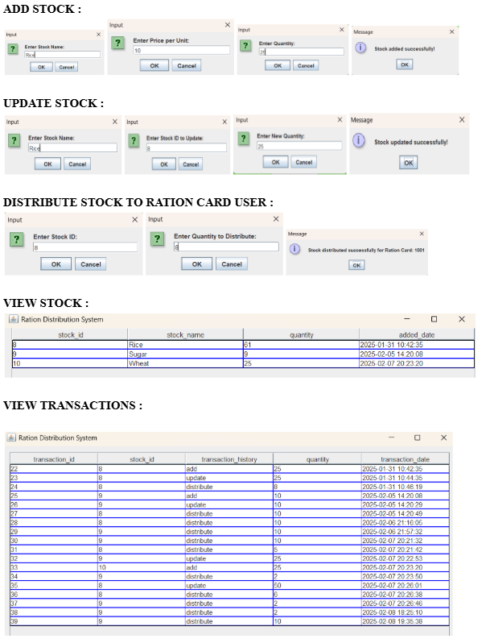
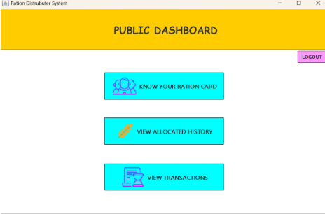

Ration Distribution Management System

A Java-based desktop application developed to manage and distribute ration stock efficiently using role-based access for Distributors and Public Users.

---

Project Overview

The Ration Distribution Management System is designed to simplify ration stock management and distribution processes. The system provides separate dashboards and functionalities for Distributors and Public Users to ensure secure and organized ration allocation and transaction tracking.

---

Features

Distributor Module

- Secure Distributor Login
- Add Stock
- Update Stock
- View Available Stock
- Distribute Stock to Ration Card Users
- View Transaction History

Public User Module

- Secure Public Login
- View Family Members linked to Ration Card
- View Allocated Stock
- View Transaction History

---

Technologies Used

- Java
- Java Swing
- MySQL
- JDBC
- Object-Oriented Programming (OOP)

---

System Workflow

1️⃣ Role Selection

The application starts with a role selection screen where users can choose:
- Distributor Login
- Public Login

2️⃣ Distributor Login

Distributor logs in using:
- Distributor ID
- Password

After successful login, the distributor can:
- Manage stock
- Distribute ration
- Track transactions

3️⃣ Public Login

Public users log in using:
- Ration Card Number
- Password

After successful login, users can:
- View member details
- Check allocation history
- View transactions

---

Screenshots

Login



Distributor Dashboard



CRUD Operations



Public Dashboard



---

Project Structure

```text
ration-distribution-management-system/
│
├── src/
├── database/
├── images/
├── README.md
└── .gitignore
```

---

Database Setup

1. Install MySQL
2. Create database
3. Import SQL tables
4. Update JDBC database credentials in project files

---

How to Run

1. Open project in IDE (NetBeans / IntelliJ / Eclipse)
2. Configure MySQL database
3. Run the main Java file
4. Start using the application

---

Learning Outcomes

- Java Swing GUI Development
- JDBC Database Connectivity
- CRUD Operations
- Role-Based Authentication
- Transaction Management
- Desktop Application Development

---

Author

Vinayak Kokare  
Software Developer 

---
